# GymBells exercises

**[Browse the catalogue →](https://gellyfish-ai.github.io/gymbells-exercises/)**

297 gym exercises with illustrations, a start and an end picture each, plus names, other names,
steps, equipment and muscles. They are made for the [GymBells](https://gellyfish.dev/gymbells/) app and
shared here for non-commercial use. Release 0.3.0 (2026-10-06).

<table>
<tr><td align="center"><a href="https://gellyfish-ai.github.io/gymbells-exercises/#Barbell_Squat">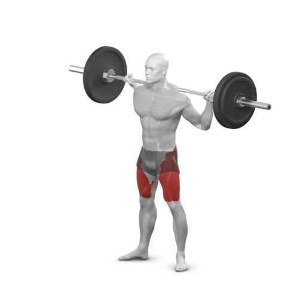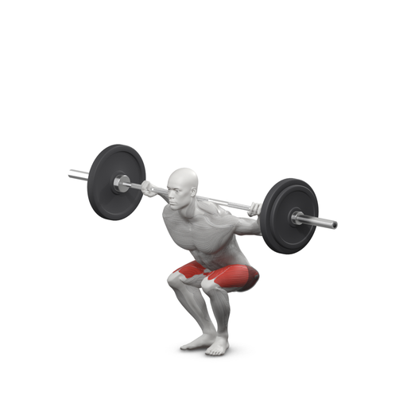</a><br><b>Barbell Back Squat</b></td><td align="center"><a href="https://gellyfish-ai.github.io/gymbells-exercises/#Barbell_Deadlift">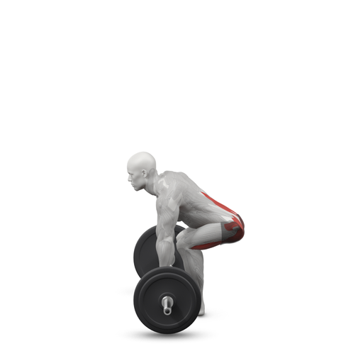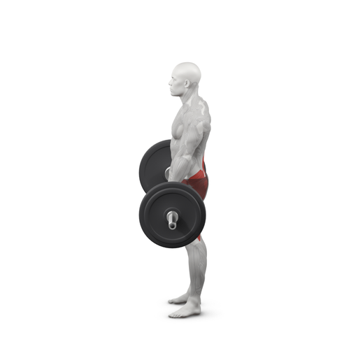</a><br><b>Barbell Deadlift</b></td></tr>
<tr><td align="center"><a href="https://gellyfish-ai.github.io/gymbells-exercises/#Barbell_Bench_Press_-_Medium_Grip">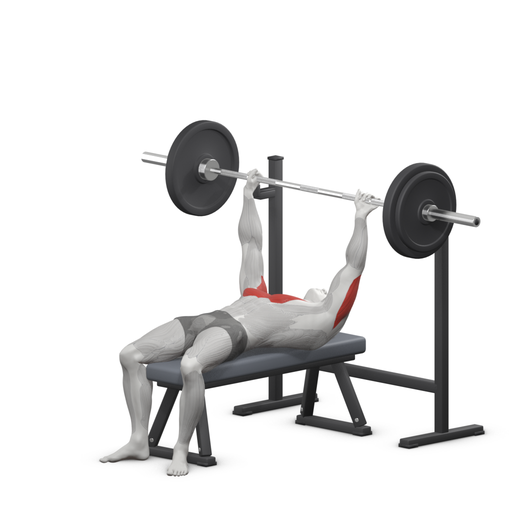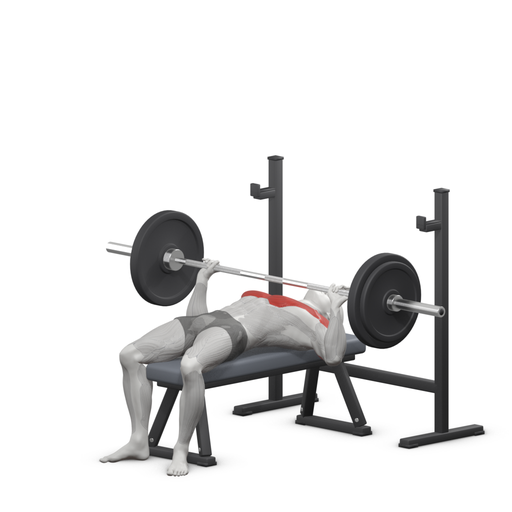</a><br><b>Barbell Bench Press</b></td><td align="center"><a href="https://gellyfish-ai.github.io/gymbells-exercises/#Pullups">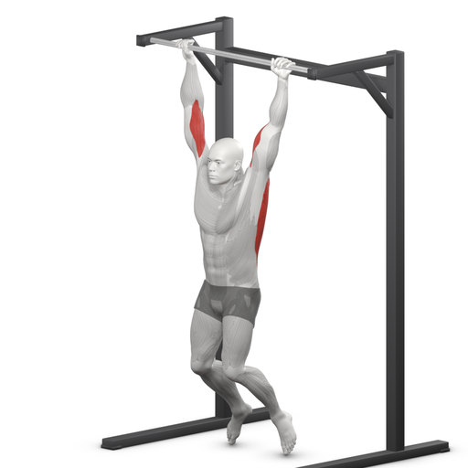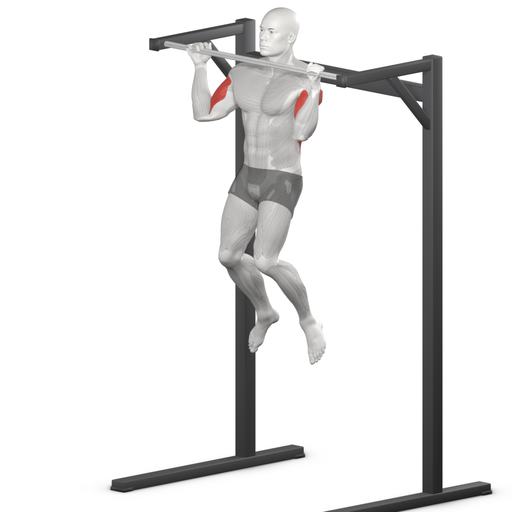</a><br><b>Pull-Up</b></td></tr>
<tr><td align="center"><a href="https://gellyfish-ai.github.io/gymbells-exercises/#Standing_Military_Press">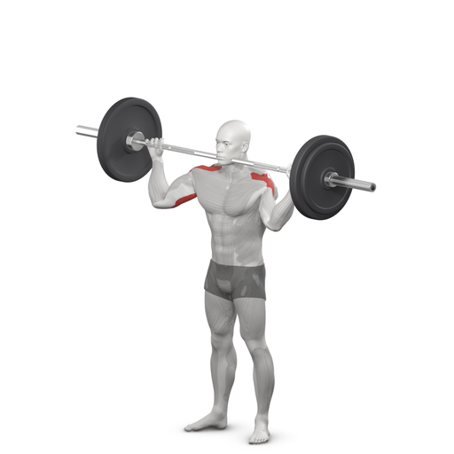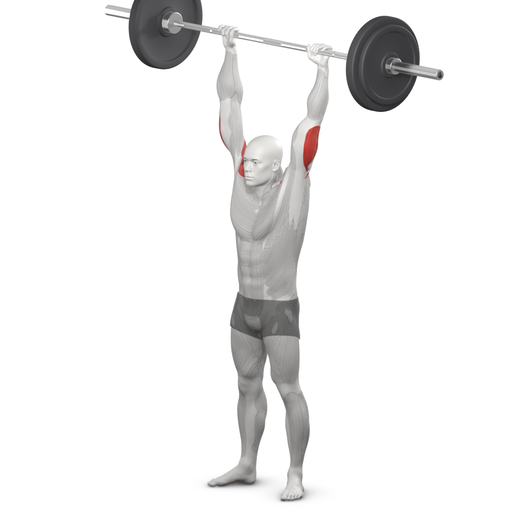</a><br><b>Barbell Overhead Press</b></td><td align="center"><a href="https://gellyfish-ai.github.io/gymbells-exercises/#Romanian_Deadlift">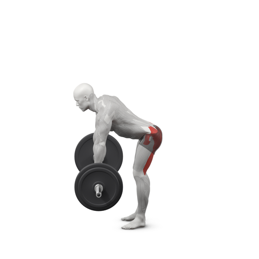</a><br><b>Romanian Deadlift</b></td></tr>
<tr><td align="center"><a href="https://gellyfish-ai.github.io/gymbells-exercises/#Barbell_Hip_Thrust">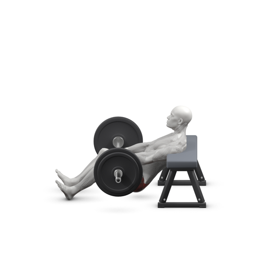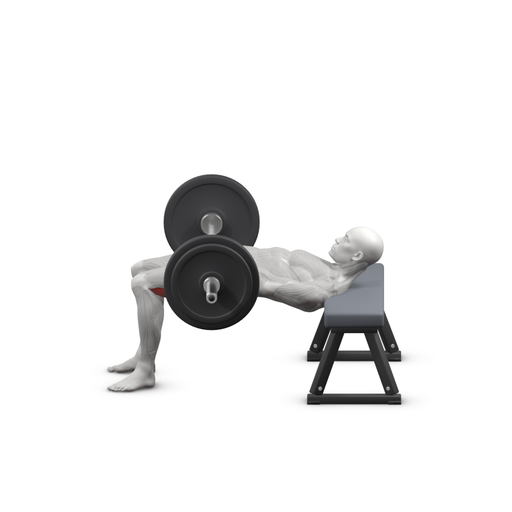</a><br><b>Barbell Hip Thrust</b></td><td align="center"><a href="https://gellyfish-ai.github.io/gymbells-exercises/#Seated_Cable_Rows">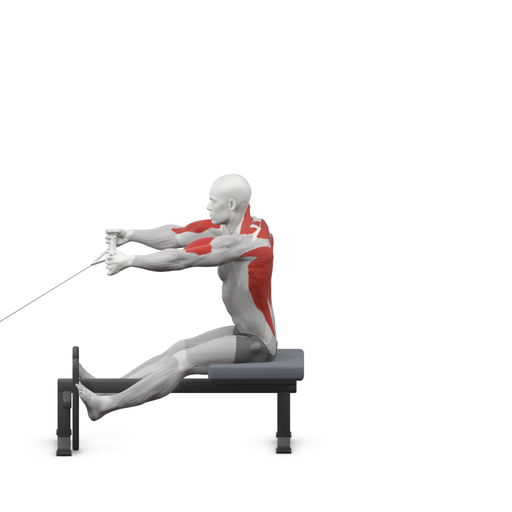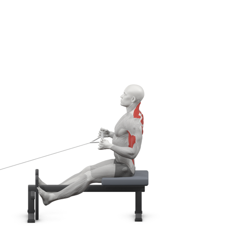</a><br><b>Seated Cable Row</b></td></tr>
</table>

By equipment: Barbell 71, Dumbbell 59, Bodyweight 33, Cable machine 32, Kettlebell 21, Band 6, Lat pulldown machine 6, Smith machine 6, Flat bench 5, Pull-up bar 5, EZ bar 4, Seated cable row 4, Dip bars 3, Leg press machine 3, Medicine ball 3, other 36.

## Files

```
images/<pose>/start.png, end.png   512 px pictures on white; several exercises can share one pose
exercises.json                     per exercise id: pose, equipment, primary and secondary muscles, level, mechanic, pattern, category
text/en.json                       per exercise id: name, other names, steps; labels for muscles, equipment, levels
```

Exercise ids never change. An empty equipment list means bodyweight only. The site
(`index.html`, `site.js`, `site.css`) runs from these files; to run it locally, `python3 -m http.server`
and open http://localhost:8000.

## Licence

[CC BY-NC 4.0](https://creativecommons.org/licenses/by-nc/4.0/) for the pictures, data and text; the site code
(`index.html`, `site.js`, `site.css`) is MIT. See [LICENSE](LICENSE), which also notes the public-domain
fields from free-exercise-db. Credit GymBells and link to it wherever you use the pictures or the text:

> Exercise illustrations by [GymBells](https://gellyfish.dev/gymbells/), CC BY-NC 4.0

## Commercial licence

For commercial use, full-size transparent images, translations or your own colours, contact us via
[gellyfish.dev/gymbells](https://gellyfish.dev/gymbells/).
