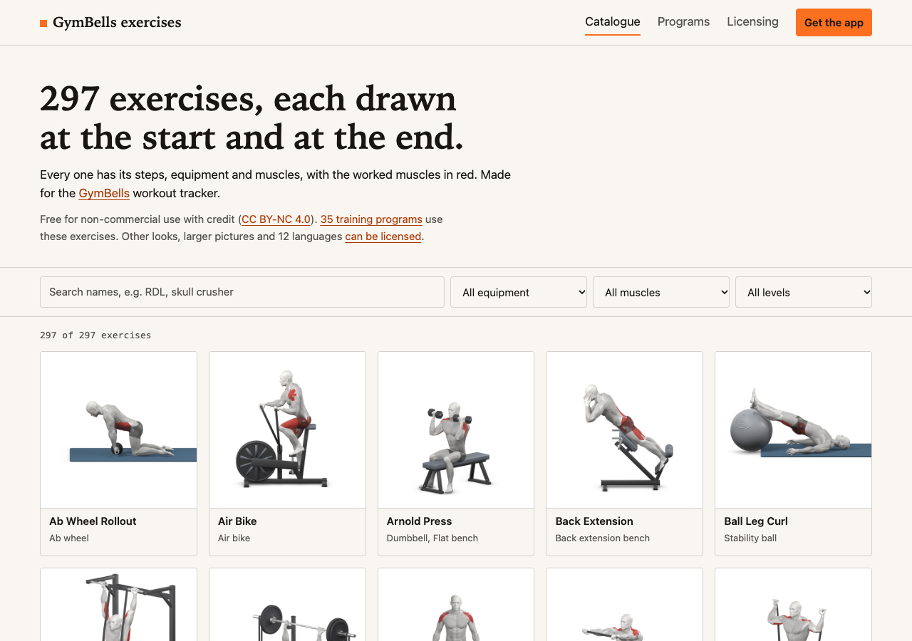
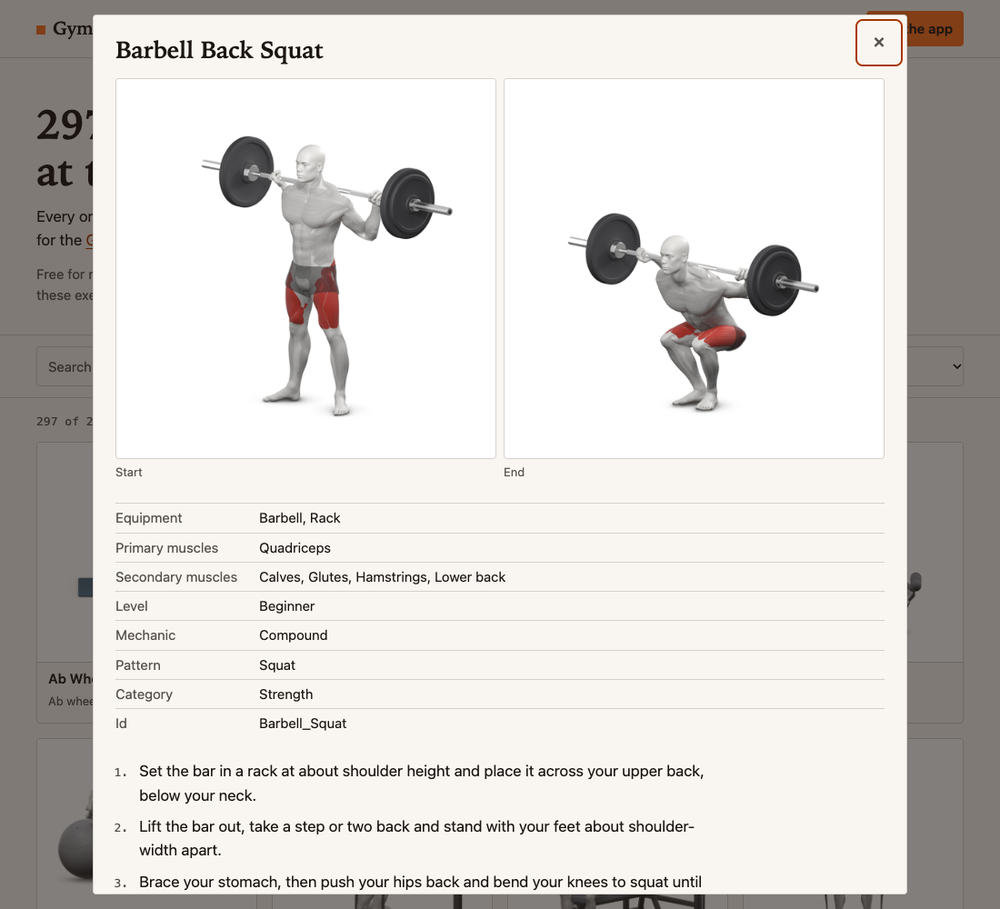
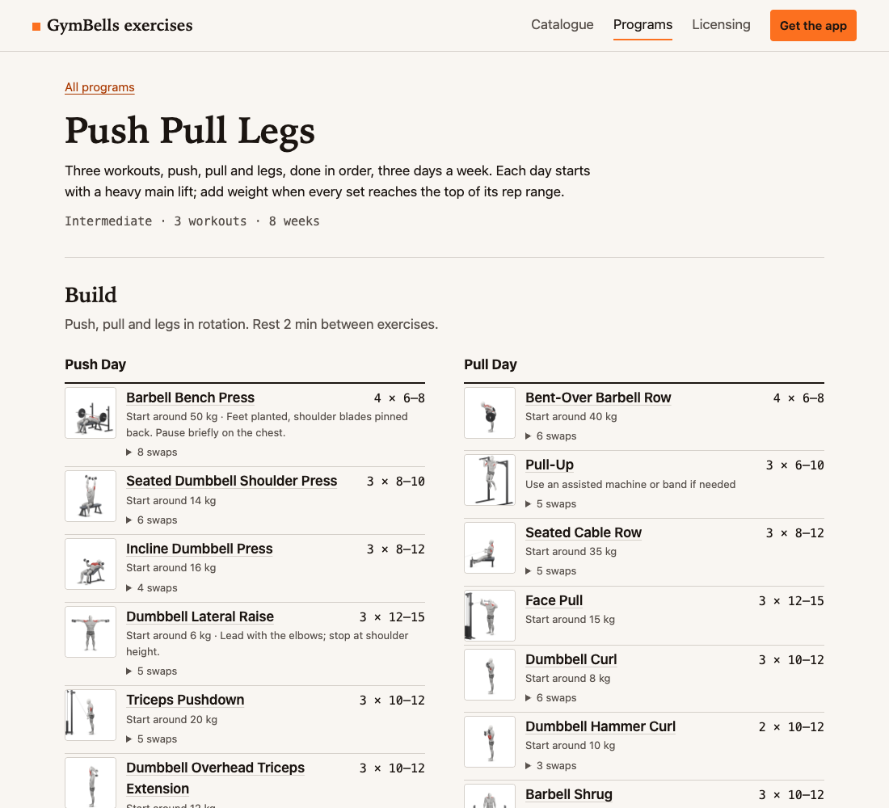
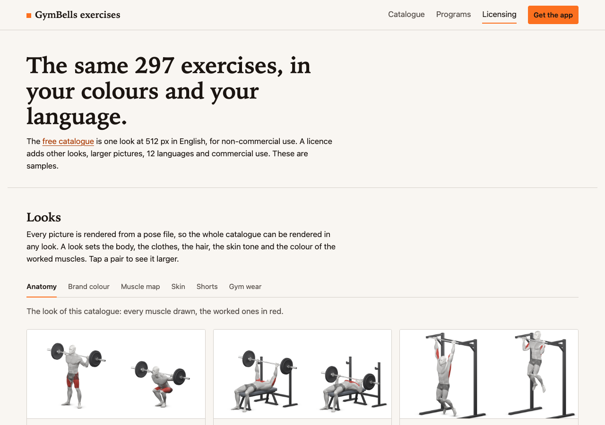

# GymBells exercises

**[Browse the catalogue →](https://gellyfish-ai.github.io/gymbells-exercises/)**

297 gym exercises with illustrations and 35 training programs, free for non-commercial use. They are made
for the [GymBells](https://gymbells.gellyfish.dev) app and shared here. Release 0.3.0 (2026-10-06).

[](https://gellyfish-ai.github.io/gymbells-exercises/)

## What is here

- **297 exercises**, each with a start and an end picture (512 px, on white), a name, other names it goes by,
  steps, equipment, primary and secondary muscles, level, and which exercises can replace it or are easier or harder.
- **35 training programs** written out in full: phases, days, exercises, sets, repetitions, rests,
  starting weights and swaps.
- **A site** to browse both: [catalogue](https://gellyfish-ai.github.io/gymbells-exercises/),
  [programs](https://gellyfish-ai.github.io/gymbells-exercises/programs.html),
  [samples and licensing](https://gellyfish-ai.github.io/gymbells-exercises/more.html).

By equipment: Barbell 71, Dumbbell 59, Bodyweight 33, Cable machine 32, Kettlebell 21, Band 6, Lat pulldown machine 6, Smith machine 6, Flat bench 5, Pull-up bar 5, EZ bar 4, Seated cable row 4, Dip bars 3, Leg press machine 3, Medicine ball 3, other 36.

<table>
<tr>
<td width="50%"><a href="https://gellyfish-ai.github.io/gymbells-exercises/#Barbell_Squat"></a><br>An exercise: pictures, steps, swaps, the programs that use it</td>
<td width="50%"><a href="https://gellyfish-ai.github.io/gymbells-exercises/programs.html#push-pull-legs"></a><br>A program, day by day</td>
</tr>
</table>

<table>
<tr><td align="center"><a href="https://gellyfish-ai.github.io/gymbells-exercises/#Barbell_Squat"></a><br><b>Barbell Back Squat</b></td><td align="center"><a href="https://gellyfish-ai.github.io/gymbells-exercises/#Barbell_Deadlift"></a><br><b>Barbell Deadlift</b></td></tr>
<tr><td align="center"><a href="https://gellyfish-ai.github.io/gymbells-exercises/#Barbell_Bench_Press_-_Medium_Grip"></a><br><b>Barbell Bench Press</b></td><td align="center"><a href="https://gellyfish-ai.github.io/gymbells-exercises/#Pullups"></a><br><b>Pull-Up</b></td></tr>
<tr><td align="center"><a href="https://gellyfish-ai.github.io/gymbells-exercises/#Standing_Military_Press"></a><br><b>Barbell Overhead Press</b></td><td align="center"><a href="https://gellyfish-ai.github.io/gymbells-exercises/#Romanian_Deadlift"></a><br><b>Romanian Deadlift</b></td></tr>
<tr><td align="center"><a href="https://gellyfish-ai.github.io/gymbells-exercises/#Barbell_Hip_Thrust"></a><br><b>Barbell Hip Thrust</b></td><td align="center"><a href="https://gellyfish-ai.github.io/gymbells-exercises/#Seated_Cable_Rows"></a><br><b>Seated Cable Row</b></td></tr>
</table>

## The app

The programs are meant to be followed in [GymBells](https://gymbells.gellyfish.dev), an iOS app that tracks them:
it shows the day's workout with these pictures, records sets and weights, and moves you through the weeks.

## Using the data

```
images/<pose>/start.png, end.png   512 px pictures on white; several exercises can share one pose
exercises.json                     per exercise id: pose, equipment, primary and secondary muscles, level, mechanic, pattern, category, swaps, easier, harder
text/en.json                       per exercise id: name, other names, steps; labels for muscles, equipment, levels
programs/index.json                the programs (level, workouts, weeks) and, per exercise id, the programs that use it
programs/<id>.json                 one program: phases, days, exercises by id, sets, repetitions, rests, starting weights, swaps
```

Every file is also served by the site, so it can be fetched without cloning:

```js
const base = "https://gellyfish-ai.github.io/gymbells-exercises/";
const [data, text] = await Promise.all(
  ["exercises.json", "text/en.json"].map((f) => fetch(base + f).then((r) => r.json())));

const id = "Barbell_Squat";
const exercise = data.exercises[id];       // { pose: "barbell-back-squat", equipment: ["barbell", "rack"], primary_muscles: ["quadriceps"], ... }
const { name, steps } = text.exercises[id]; // "Barbell Back Squat", [ "Set the bar in a rack ...", ... ]
const picture = `${base}images/${exercise.pose}/start.png`;
```

Exercise ids never change. An empty equipment list means bodyweight only. To run the site locally,
`python3 -m http.server` in a clone and open http://localhost:8000.

## Licence

[CC BY-NC 4.0](https://creativecommons.org/licenses/by-nc/4.0/) for the pictures, data and text; the site code
(the `.html`, `.js` and `.css` files) is MIT. See [LICENSE](LICENSE), which also notes the public-domain
fields from free-exercise-db. Credit GymBells and link to it wherever you use the pictures or the text:

> Exercise illustrations by [GymBells](https://gymbells.gellyfish.dev), CC BY-NC 4.0

## Commercial licence

For commercial use there is more than this set: other looks or your own colours, larger transparent pictures and
more languages. The [samples page](https://gellyfish-ai.github.io/gymbells-exercises/more.html) shows them; contact us
via [gymbells.gellyfish.dev](https://gymbells.gellyfish.dev).

[](https://gellyfish-ai.github.io/gymbells-exercises/more.html)
